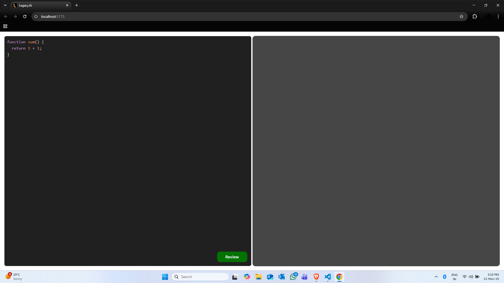
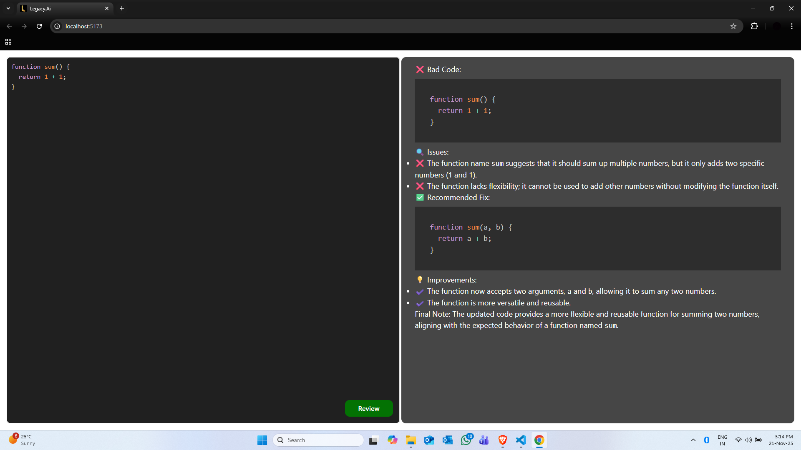

# Legacy.Ai

Legacy.Ai is a small example project that demonstrates using a backend Express API to call a Gemini generative model for automated code review, with a lightweight React + Vite frontend to submit code and display the review.

<p align='center'>

</p>

This repository has two main pieces:

- BackEnd/: Node.js + Express server that wraps the Gemini generative model and exposes an API endpoint.
- FrontEnd/: React (Vite) app that provides a code editor and displays the model's review.

<p align='center'>

</p>

## Quick architecture

- FrontEnd (Vite + React) sends POST requests to the BackEnd endpoint `/ai/get-review` with a JSON body { code: string }.
- BackEnd forwards the prompt to the Gemini generative model via `@google/generative-ai` and returns the model's text response to the FrontEnd.

## What it's useful for

- Prototyping automated code review features.

## Running locally

Prerequisites:

- Node.js (16+ recommended)
- npm
- A Gemini API key (set as `GEMINI_API_KEY` in the environment)

1) BackEnd

```powershell
cd BackEnd
npm install
# Set the GEMINI_API_KEY for the current PowerShell session
$env:GEMINI_API_KEY = "your_gemini_api_key_here"
# Start the backend (server listens on port 3000)
node server.js
```

Notes:
- The Gemini API key is read from `process.env.GEMINI_API_KEY`.

2) FrontEnd

```powershell
cd FrontEnd
npm install
npm run dev
```

- The FrontEnd uses Vite. By default it will run on `http://localhost:5173` (or another free port).
- The app posts to `http://localhost:3000/ai/get-review` in development. If you change backend port, update the frontend request URL in `FrontEnd/src/App.jsx`.

## API (BackEnd)

POST /ai/get-review

- Request body (JSON): { code: string }
- Success: 200 with the model's review text in the response body.
- Error: 400 when `code` is missing; 5xx for other internal errors.

Example request (curl):

```bash
curl -X POST http://localhost:3000/ai/get-review \
  -H "Content-Type: application/json" \
  -d '{"code":"console.log(\"hello\")"}'
```

## How Gemini is used

- The service implementation is in `BackEnd/src/services/ai.service.js`.
- It creates a `GoogleGenerativeAI` client using the `GEMINI_API_KEY` environment variable and requests the `gemini-2.0-flash` model.
- A `systemInstruction` is passed to the model to instruct it to act as a senior code reviewer. The server calls `model.generateContent(prompt)` and returns `result.response.text()`.

## Environment variables

- GEMINI_API_KEY — API key for Google Gemini/Generative AI. Required by the backend.

## Troubleshooting

- If the frontend cannot reach the backend, ensure the backend is running on port 3000 and that CORS is enabled (the backend already uses `cors()` in `src/app.js`).
- If the model call fails, check that `GEMINI_API_KEY` is set and valid.

## Files of interest

- `BackEnd/server.js` — starts the server on port 3000.
- `BackEnd/src/app.js` — Express app wiring.
- `BackEnd/src/routes/ai.routes.js` — route definitions.
- `BackEnd/src/controllers/ai.controller.js` — controller.
- `BackEnd/src/services/ai.service.js` — Gemini integration and system instruction.
- `FrontEnd/src/App.jsx` — frontend code editor and request logic.

## Connect with me
- **LinkedIn:** https://www.linkedin.com/in/devadi
- **GitHub:** https://github.com/ADI-2707
